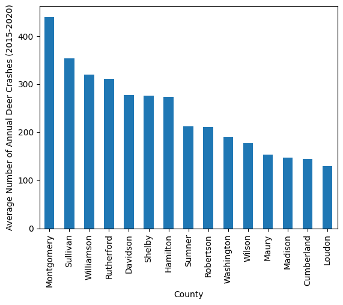

Data Analysis using Pandas and Matplotlib

Full Write Up Below

TLDR: 
In conclusion, the analysis utilized three datasets: deer crashes, forested acreage, and population. These datasets were chosen to find the best three counties for a Grill Guard business. Montgomery County was selected due to its high number of deer crashes, which was confirmed as Montgomery County also had a large number of deer crashes relative to forested acreage and population. Sullivan County was also chosen for similar reasons, with most of the data for Sullivan County being similar to or above those of Montgomery County. Finally, Robertson County was selected for its large number of deer crashes relative to forested acreage and population. Although Figure 1 does not make the best case for Robertson County, Figures 3 and 5 show it leading by a large margin. This suggests that Robertson County, despite its smaller size, would have a large portion of citizens interested in becoming customers at a Grill Guard business. Overall, the selected counties exhibit a high demand for grill guards, making them ideal locations for the business.
	

Full Write Up:
The three best counties for a Grill Guard business are as follows:

Montgomery County
Sullivan County
Robertson County

The specific reasoning for each of the three counties is discussed at the end of the report. Moreover, in this report, any actions discussed will use the third person pronoun, “we”, for uniformity. Lastly, this report discusses deer crashes and focuses on counties with a large amount of deer crashes; though deer crashes are not traditionally a positive, in order to sell grill guards, higher amounts of deer crashes lead to higher amounts of demand. 
These three counties were selected largely based on the following three factors: deer crashes, forest acreage, and population. Thus three of the given data sets were used. From the State of Tennessee's data, we selected the deer-crashes dataset (Link: https://data.tn.gov/dataset/deer-crashes) and the forest-acreage dataset (Link: https://data.tn.gov/dataset/forested-acreage). From the US census data, we selected the population dataset, which contained the 2020 population, along with predictions up to 2023, for each county in Tennessee. 
The remaining two datasets, speeding citations and cattle inventory, were not chosen. The speeding citations dataset was not chosen because of the lack of specificity to our questions. In other words, many factors result in speeding citations, which may not impact how successful a grill guard service will be. Unlike the datasets selected, there may not be a direct relation between the possibility of selling grill guards and speeding citations
Similarly, cattle inventory may provide information about farms, however these are not necessarily related to grill guards. Moreover, information about farms can shed light on places that may need grill guards, however, grill guards can be used for a larger variety of purposes than just farm use.
Deer crashes was the first dataset selected. This is because this dataset most directly relates to selling grill guards. If the main purpose of grill guards is to protect against deer crashes, then places with the most deer crashes will want and need grill guards the most. 
The second dataset selected was forest acreage. This dataset was selected for two main reasons. First, counties with a large amount of forest acreage may have a larger population of deer, as a result of the deer having a larger habitat. Seemingly, the more deer, the more deer crashes and therefore, the greater need for grill guards. Secondly, having information about the forest acreage allows for more context for our deer crashes dataset. If a county has an especially large amount of forest acreage, then the county would seemingly have more deer crashes. However, by only looking at the number of deer crashes, it may seem that there is a large number of crashes in a county, only to find that the county has an even larger amount, relatively, of forest acreage.
With this in mind, our main consideration for the location of the business is deer crashes, however, the amount of deer crashes relative to forest acreage is also a relevant piece of information.  A county with more deer crashes may be a county with a large need for grill guards, while a large amount of deer crashes relative to forest acreage signals a county that has deer crashes more frequently, which also leads to a larger need for grill guards.
The third dataset selected was population information by county. Similar to the forest acreage dataset, the population dataset serves as more context to the other data we are working with. Simply put, the larger the population of a county, the more prospective grill guard customers. In theory, a county that has the most deer crashes, with the largest forest acreage, and a booming population would be the best possible place for a Grill Guard business. To get the three counties, the goal was to marry the three aforementioned characteristics to find the best counties. A large emphasis was placed on identifying counties with a large amount of deer crashes, with forest acreage and population being auxiliary attributes. Moreover, large outliers (e.g. a county that stood out based on a large number of deer crashes relative to forest acreage) also stood out and served as possible selections for the three best counties for a Grill Guard business.
As we moved to clean and prepare the data, we first began with the deer crashes dataset. As previously mentioned, with this being selected as the most topical dataset for our research, the deer crashes dataset served as a lens for any other analysis.
After loading in our dataset from a CSV to a Pandas dataframe, using the pd.read_csv method, there was a null column which was dropped using the .drop() function. Moreover, the last row also contained null values, therefore that row was dropped using the .dropna() function. In the end, our data frame included 570 rows, with four columns, for a total of 2280 observations. However, our fourth row—”LastReportedDate”—was also unnecessary and was not used in our analysis.
The deer crashes dataset includes the total number of deer crashes for each county in Tennessee spanning each year from 2015 to 2020. Therefore, we can find the average number of deer crashes over a five year span, in each county. This allows us to look at deer crashes with a wider view, making us less susceptible to outlier years, as opposed to looking at a singular year. Although a single year, in this case 2020, may provide us with the most recent data, a five year average allows us to find counties that have historically had deer crashes, indicating a need for grill guards.
According to all datasets used, Tennessee has 95 counties. For this reason, it would be time-consuming and difficult to interpret visualizations of the given statistics for all of the 95 counties for all of the datasets used. To circumvent this problem, we can revisit the claim that deer crashes are the most important and topical piece of information we have, in relation to finding markets for grill guards. Given the fact that this is true, the best way to cut down from 95 counties would be to take the top portion, in this case 15 counties, of the 95 counties in terms of deer crashes. These 15 counties were the counties with the largest five year average deer crash totals. 
The code is explained below:
We first used the .groupby() function to group deer crash totals by year, by county. Also, we used the .mean() function to find the five year average. 
deer_crashes.groupby("County")["Value"].mean()
Then, in order to select only the top 15, we used the .nlargest() function, and passed in 15 as an argument. Moreover, we casted the groupby object into a dictionary (called top_fifteen), using .to_dict(), so that it would be easier to print and visualize.
top_fifteen = deer_crashes.groupby("County")["Value"].mean().nlargest(15).to_dict()
Figure 1 displays a bar graph of the 15 counties which had the highest number of deer crashes from 2015 to 2020. The county with the most average deer crashes per year from 2015-2020 was Montgomery County with 441 deer crashes a year. Naturally, Montgomery County was a front runner and a premier spot for a Grill Guard business. On the other hand, Loudon County, which was the last county to make this list, only had an average of 130 deer crashes per year. For this reason, despite being plotted, Loudon County would likely not be a top three candidate for the business, unless Loudon County had somehow stood out as a large outlier in any other datasets.
All future analysis was based upon the selection of the 15 counties. Although the most important dataset, the reason that deer crashes dataset gave us our top 15 counties—and not our top three—was because confounding variables still remain.In addition to providing more context as discussed above, we can combine data from different datasets. For example, some counties may have more deer crashes because they have more forest area. While this may be a good thing for a business selling Grill Guards, it may also be an indication that deer crashes are not as common as the raw numbers suggest. For this reason, we will also visualize the number of deer crashes per forested acres for the top 15 counties selected. Additionally, this provides further justification for cutting down the number of counties from 95 to 15 with the first dataset: if we visualized the number of deer crashes per forested area for 95 counties, we would have too many data to look at.
Similar to the deer crashes dataset, the forested acres had an extra column which contained only null values. This row was dropped. In order to index the forested acres dataframe to only include the 15 counties from the deer crashes dataset, we made use of the .isin() function, which returns boolean values. These boolean values were then used to index through the forested acres dataframe as shown:
forested_acres = forested_acres[forested_acres["CountyName"].isin(top_fifteen)]
The raw numbers of forested acres for each of the top 15 counties are visualized in Figure 2. As seen in the graph, a county’s forested area doesn't seem to perfectly relate to deer crashes. For example, Montgomery County, which had the most average annual deer crashes, only has about a typical amount of forested area. On the other hand, Cumberland County had the second lowest deer crashes, as seen in Figure 1, but had the largest amount of forested area. Initially, it may seem that Cumberland County should be considered in the top three counties, as a result of a massive amount of forested area. However, when combining information from the deer crashes dataset and the forested acres dataset, the data tell us that despite having a large amount of forested area, Cumberland County does not have many deer crashes at all. Thus, Cumberland County is most definitely out of our top three. 
The logic used to remove Cumberland County can also be applied to get a new visualization of the data in order to find the best three counties for a Grill Guard business. The logic is as follows: a large amount of deer crashes implies a larger demand for grill guards. Moreover, a large amount of deer crashes, with a relatively small forested area may suggest that deer crashes are more common and more prevalent in those counties. Thus, to find the places where demand for grill guards may be high, we can not only look at the raw number of deer crashes, but the number of deer crashes relative to forested area. 
It may be argued that looking at total acreage for a county may provide similar, or more appropriate, insights to measure how common deer crashes are relative to the size. However, by looking at total acreage, we may introduce additional confounding variables such as the existence of urban areas. Hypothetically, if there was a county with a small amount of forest, and a relatively large amount of deer crashes, that county would be a good candidate for a’s business as the area around the forest is a hotspot for deer crashes. However, if that county was naturally larger, we may not seem the aforementioned relationship. In other words, it was preferred to gain context for deer crashes through the habitat for deers, as opposed to that of humans.
To calculate the number of deer crashes, for each county, relative to the forested acres,we divide deer crashes by forested area. An interpretation for the quotient of those two numbers is, the amount of deer crashes for every acre of forest. The more deer crashes a county has per acre, the more the need will be for grill guards. The equation is as follows:

 Relative Number of Deer Crashes = Average Annual Deer Crashes (2015-2020)Number of forested acres (2018)

As seen in the equation, we are comparing deer crash data that were collected from 2015 to 2020 to forested acre data that were collected from 2018. For this reason, the exact numbers may not be perfectly comparable. Ideally we would compare deer crash data to forested acre data for respective years, or, at the very least, the respective range of years. However, because those data are not available to us, that is not possible. Nonetheless, given the fact that 2018 falls within our range of deer crash data, and the fact that we took the average of all years from 2015 to 2020, the comparison should still be valid.
Implementing the above equation in the Python notebook required combining information from two separate datasets. For this to happen, both datasets need to be formatted the same so that equation can be used for every county in our top 15. First, as seen in Figures 1 and 2, the order of counties in the top 15 is not the same as the order of those counties in the forested acres dataset. The former is from highest to lowest, while the latter is in alphabetical order. Thus, we decided to alphabetize the top_fifteen dictionary (which contains the selected parts of the deer crashes dataset) so that the two datasets would match. To accomplish this, we used a for loop which iterated through a list of the sorted keys from top_fifteen, and reassigned the values in alphabetical order. The code was as follows:
top_fifteen = {element: top_fifteen.get(element) for element in sorted(top_fifteen.keys())}
	Similarly, the groupby object that contained the forest acreage for the top 15 counties was also cast to a dictionary, using the to_dict() method, so that we could perform operations with the two dictionaries. Specifically, the relative number of deer crashes was stored in a separate dictionary, so that the relative number could still be paired with the county. The code below was used:
	dc_per_fa = {} #Deer crashes per forested acre
for key in top_fifteen:
  dc_per_fa[key] = top_fifteen[key]/forested_acreage[key]
	The abbreviation dc_per_fa was used to stand for deer crashes per forested acre, which is also known as the relative number of deer crashes. A for loop was used to index through the keys in top_fifteen and divide the respective values with the values for forested acreage. Because the same keys were used for all dictionaries, only one for loop was necessary. The same key allowed us to iterate through both the top_fifteen dictionary and forested_acreage dictionary as they were both in alphabetical order.
	The bar graph for dc_per fa is shown in Figure 3. To start off, Figure 3 allows us to confirm Montgomery County and Sullivan County as top candidates for a Grill Guard business. Both counties were first and second, respectively, in terms of deer crashes and stand in the top 3 for the relative number of deer crashes, slightly above Washington County. However, the largest outlier for the relative number of deer crashes is Robertson County, which stands at a deer crashes per forested acre value that is double that of Montgomery County and Sullivan County. Robertson County only has the ninth most deer crashes, however with a relatively smaller forested area, deer crashes may be more common in Robertson County. With an outlier that is almost double that of the second and third counties, it makes sense to include Robertson County in the top 3.
	Before a final decision is made, we must compare our preliminary results with overall population data. Ultimately, people buy grill guards, so the top three recommendations should have populations that are large enough to support a Grill Guard business, but small enough so that customers can access the location. The three recommendations need not have the largest populations; they should just have populations that allow for the business to stand out, compared to other candidates. 
	Thus the population dataset is used. Specifically, we used the 2020 actual numbers as that was the most reliable piece of information. After loading the data as a dataframe, named population, we found that the data were formatted incorrectly and could not be spliced or visualized.
	First, the column names needed to be replaced. This was completed by creating two lists: one that contained the new column names and one containing the old column names. The code is below:
	
column_names = ["County", "2020 Actual", "2020 Pred", "2021 Pred", "2022 Pred", "2023 Pred"]
current_columns= list(population.columns)
	Then, the elements from the lists were stored in a dictionary so that the key was the current column name, while the value was the column name that would replace the current one. Lastly, the .rename() function was used to rename the columns in the population dataframe. The code is shown below:
	hash_map = {}
for i in range(len(current_columns)):
  hash_map[current_columns[i]] = column_names[i]
population.rename(hash_map, axis = 1, inplace = True)
With the columns properly named, null values were dropped. These null values did not need to be replaced, because they simply existed as a result of the formatting of the original dataset. Additionally, the formatting of the county names meant that the names had periods at the beginning and commas in the middle of them. These needed to be removed so that the style of county names from top_fifteen could also be applied to the new dataset. This was accomplished with the following code:
	for i in range(len(population)):
    	population["County"].iloc[i]= population["County"].iloc[i][(population["County"].iloc[i].index(".") + 1):population["County"].iloc[i].index(" ")]
The above code iterates through the County column and splices the string in between the period and the comma. By using the iloc function, we use indexes, allowing us to find the indexes of the period and comma, as they vary based on the length of the county’s name. This allows for the naming conventions to match between all our datasets.
Lastly, to ensure the numbers in the population dataset are of the type float and not string, we use the following code:
population['2020 Actual'] = pd.to_numeric(population['2020 Actual'], errors='coerce').astype(float)
By using the to_numeric function, we can cast the strings to numbers so that we can graph the populations as shown in Figure 4. As seen in the graph, the counties of Montgomery, Sullivan and Robertson have low populations, which may cause some concern regarding them as our top candidates. However, for a Grill Guard business, a county with a large number of people, but a lack of demand for grill guards is unhelpful. Therefore, a more appropriate use of population was to find the number of deer crashes that occurred per person in the county. Counties with more deer crashes per person would have more demand for grill guards as seemingly deer crashes are more common.
Thus, using the same logic as when we compared deer crashes to forest area, we can divide the number of deer crashes by the population to find the number of deer crashes per person as shown:

Deer Crashes per Person = Average Annual Deer Crashes (2015-2020)Population of County (2020)

This operation is the same as that of the relative number of deer crashes, with the denominator being different. Similar concerns may be expressed about the numerator and denominator containing data from separate years. However, we are still able to understand a rough measure of deer crashes per person with the data we have. In addition, the code to visualize deer crashes per person was similar to the relative number of deer crashes. By grouping the population data for the 15 counties and storing it in a dictionary, named pop_hash, we executed the following code to build a new dictionary that had keys as the county names and values as the number of deer crashes per person:
dc_per_pop = {}
for key in top_fifteen:
  dc_per_pop[key] = top_fifteen[key]/pop_hash[key]

Then, dc_per_pop was plotted, as seen in Figure 5. Sullivan County and Robertson County stand out in terms of deer crashes per person. However, other counties, like Cumberland County and Loudon County have more deer crashes per person as compared to Montgomery County. While Cumberland County and Loudon County may have a slight advantage over Montgomery County in deer crashes per person, as mentioned before, Montgomery County still stands out by a large amount in raw number of deer crashes (Figure 1) and deer crashes per forested acre (Figure 3). In other words, we still recommend Montgomery County since it significantly outperformed Cumberland County and Loudon County in Figures 1 and 3, despite the slight variation shown in Figure 5.
In conclusion, the analysis utilized three datasets: deer crashes, forested acreage, and population. These datasets were chosen to find the best three counties for a Grill Guard business. Montgomery County was selected due to its high number of deer crashes, which was confirmed as Montgomery County also had a large number of deer crashes relative to forested acreage and population. Sullivan County was also chosen for similar reasons, with most of the data for Sullivan County being similar to or above those of Montgomery County. Finally, Robertson County was selected for its large number of deer crashes relative to forested acreage and population. Although Figure 1 does not make the best case for Robertson County, Figures 3 and 5 show it leading by a large margin. This suggests that Robertson County, despite its smaller size, would have a large portion of citizens interested in becoming customers at a Grill Guard business. Overall, the selected counties exhibit a high demand for grill guards, making them ideal locations for the business.
	
	

Appendix:

Figure 1:

Figure 2:

Figure 3:

Figure 4:

Figure 5:

